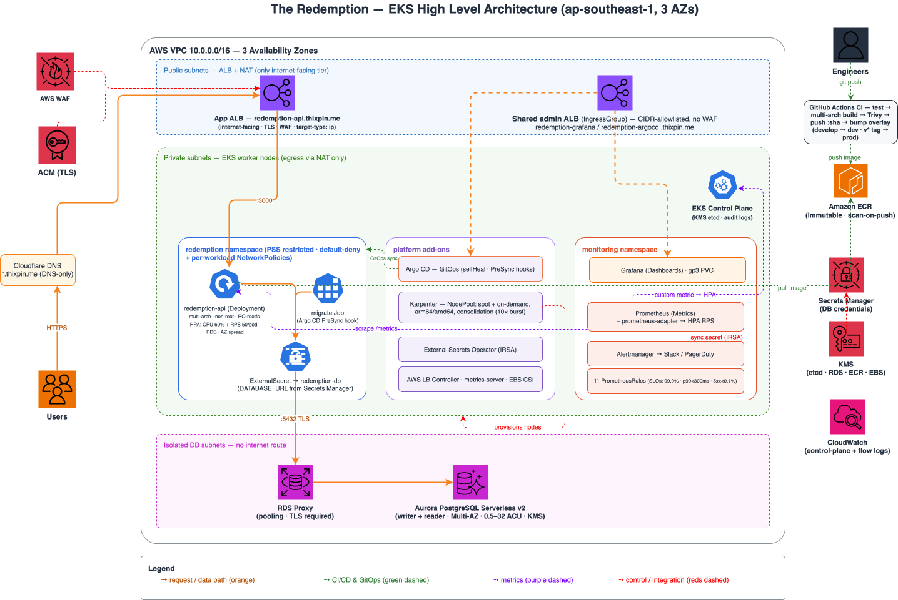

# Redemption Platform (reusable EKS + GitOps scaffold)

A production-shaped AWS EKS platform and app-delivery scaffold built with
Terraform + Kustomize + Argo CD. It was created for the Redemption service, but
it's structured so you can **drop in another (often simpler) app** and reuse the
same cluster, pipelines, and guardrails.

- **Full setup:** [`SETUP.md`](./SETUP.md) — one-time bootstrap runbook (dev).
- **Prod setup:** [`PROD-SETUP.md`](./PROD-SETUP.md) — separate-account prod bootstrap.
- **Design rationale:** [`docs/DESIGN.md`](./docs/DESIGN.md) ([PDF](./docs/DESIGN.pdf)) + [`docs/architecture.drawio`](./docs/architecture.drawio).

## Architecture Diagram


## What you get

- **Networking:** 3-tier VPC (public / private / isolated-DB) across 3 AZs, NAT, flow logs.
- **Cluster:** EKS with a small managed node group + **Karpenter** (spot/on-demand, arm64/amd64) for app capacity.
- **Delivery:** **Argo CD** GitOps; app images are immutable git-SHA tags in **ECR** (scan-on-push); CI bumps the overlay and Argo syncs.
- **Edge:** ALBs (via AWS LB Controller) with **WAF + ACM TLS** — one public ALB
  for the app, one **shared CIDR-gated admin ALB** (IngressGroup) for Grafana + Argo CD.
- **Data (optional):** Aurora PostgreSQL Serverless v2 + RDS Proxy.
- **Secrets:** AWS Secrets Manager synced by **External Secrets** (IRSA, least-privilege).
- **Autoscaling:** HPA on CPU **and** a custom RPS metric (prometheus-adapter) + Karpenter node scaling.
- **Observability:** kube-prometheus-stack (Prometheus/Grafana/Alertmanager), ServiceMonitor, alert rules.
- **Security defaults:** restricted PSS, default-deny NetworkPolicy, KMS everywhere, GitHub OIDC for CI.

## Repo layout

```
.
├── terraform/                # One root module for every environment
│   ├── *.tf                  #   vpc, eks, karpenter, addons, rds, ecr, storage,
│   │                         #   observability, variables, outputs
│   └── envs/{dev,prod}/      #   per-env backend.hcl + terraform.tfvars
├── github-actions-*.json     # CI OIDC role trust + policy (used by SETUP.md)
├── argocd/
│   ├── project.yaml          # shared AppProject
│   ├── argocd-cm-health.yaml # HPA health-check override (per cluster)
│   ├── dev/                  # DEV cluster's Applications + Argo CD UI ingress
│   └── prod/                 # PROD cluster's Applications + UI ingress
├── k8s/
│   ├── app/base/             # env-agnostic app manifests (deployment, svc,
│   │                         #   ingress, hpa, pdb, netpol, externalsecret, sa, migrate job)
│   ├── app/overlays/{dev,prod}/        # host/cert/WAF/IRSA/secret-key/image per env
│   ├── karpenter/base + overlays/      # NodePool + EC2NodeClass (role/tags per env)
│   └── observability/base + overlays/  # monitors, rules, alerting, Grafana ingress
└── docs/                     # design doc + architecture diagram
```

Environments: **dev** deploys continuously from the app repo's `develop` branch
(`deploy-dev.yaml`); **prod** (separate AWS account) deploys on release tags
(`v*` on `main`, `deploy-prod.yaml`) — the tagged commit is built, scanned, and
pushed to the prod account's own ECR. See [`PROD-SETUP.md`](./PROD-SETUP.md) for the prod bootstrap.

## Deploy a new app on this platform

Once the cluster exists (see `SETUP.md`), onboarding another app is mostly editing
the `k8s/app` manifests and pointing an Argo CD Application at them. The app only
needs to: run as a container, listen on a port, and expose a **health** endpoint
(and ideally **`/metrics`** to reuse the HPA + dashboards).

1. **ECR repo** — add one in `terraform/ecr.tf` (or reuse) and note the image URL.
2. **CI (in the app repo)** — copy `redemption-app`'s workflow: test → multi-arch
   build → Trivy scan → push `:<sha>` → bump this repo's overlay `newTag`.
   Requires `AWS_CI_ROLE_ARN` + `INFRA_REPO_TOKEN` secrets.
3. **Base manifests** (`k8s/app/base/`) — set:
   - `deployment.yaml`: image name, `containerPort`, env, resource requests/limits, probe paths.
   - `service.yaml`: port/targetPort.
   - `ingress.yaml`: `healthcheck-path` in base; `host`, ACM `certificate-arn`
     and WAF ARN live in the overlay patches (account/env-specific).
     Public app → own ALB; internal/admin UI → join the shared `redemption-admin`
     IngressGroup (`alb.ingress.kubernetes.io/group.name`) to reuse that ALB.
   - `hpa.yaml`: min/max replicas and targets.
   - `externalsecret.yaml`: the Secrets Manager key (or delete if the app has no secrets — see below).
   - `networkpolicy.yaml`: keep default-deny; adjust egress to your dependencies.
4. **Overlay** (`k8s/app/overlays/<env>/`) — per-env host, replicas, image tag.
5. **Argo CD Application** — copy `argocd/dev/application-app-dev.yaml`, set
   `repoURL` (this repo), `path` (your overlay), and `destination.namespace`;
   add the repo to `argocd/project.yaml` `sourceRepos` if new.
6. **DNS** — CNAME the host to the app's ALB (DNS-only). See `SETUP.md §9`.

## Configuration reference (Terraform)

| Variable | Purpose |
|----------|---------|
| `project`, `environment`, `region` | Naming + placement (`<project>-<environment>` is the cluster name) |
| `vpc_cidr`, `az_count` | Network sizing (≥3 AZs for HA) |
| `cluster_version` | EKS Kubernetes version |
| `cluster_admin_role_arns` | IAM roles granted cluster-admin (EKS access entries) |
| `cluster_endpoint_public_access_cidrs` | Lock the API endpoint to admin CIDRs |
| `aurora_*`, `db_*` | Database engine/capacity/name (ignore if no DB) |
| `grafana_hostname` | Public Grafana URL (sets `GF_SERVER_ROOT_URL`) |
| `ecr_replication_*` | Optional cross-account image replication (alternative to CI pushing to prod ECR) |
| `slack_webhook_url`, `pagerduty_routing_key` | Alertmanager routing |

> If you change `vpc_cidr`, also update the hardcoded CIDR in
> `k8s/app/base/networkpolicy.yaml` (ALB ingress + DB egress rules).

## Trimming for a simpler (stateless) app

If the new app has **no database**, remove the data tier to cut cost/complexity:

- Delete `terraform/rds.tf` (Aurora + RDS Proxy) and the DB outputs in `terraform/outputs.tf`.
- Delete `k8s/app/base/externalsecret.yaml` **and** `migrate-job.yaml` (no DB =
  no migrations) and drop both from `kustomization.yaml`; remove the
  `DATABASE_URL` env and the external-secrets IRSA in `terraform/addons.tf` if unused.
- Remove the `5432` egress rules (app + migrate policies) from `networkpolicy.yaml`.
- Optionally drop the database subnet tier in `terraform/main.tf`/`terraform/vpc.tf`.

Everything else (EKS, Karpenter, ALB, GitOps, observability, autoscaling) applies
unchanged. To skip dashboards too, disable the `kube-prometheus-stack` /
`prometheus-adapter` releases in `terraform/addons.tf`/`terraform/observability.tf` and the
`observability` Argo CD Application.

## Common operations

```bash
kubectl -n <ns> get pods,hpa,ingress          # workload status
kubectl -n argocd get applications            # sync/health
kubectl -n <ns> rollout restart deploy/<app>  # manual restart (rare; prefer GitOps)
```

Rollback = `git revert` in this repo (Argo CD re-syncs the previous immutable image).
See `SETUP.md` for the full lifecycle and gotchas.
